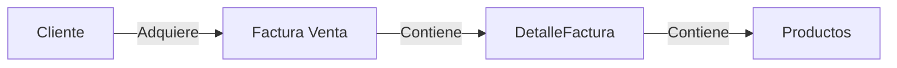

# WebBackend-API-POS-
 

<h1 align="center">Api Rest CRUD Servicios POS</h1>
<h3 align="center">By @ngmartinezs || Nestor G Martinez S</h3>

  

  

  

  

<!-- Status -->

<!-- <h4 align="center"> 
	🚧  WebBackend-API-POS-ngmartinezs 🚀 Under construction...  🚧
</h4> 

 -->

  <a href="#dart-about">Acerca de</a> &#xa0; | &#xa0; 
  <a href="#sparkles-features">Caracteristicas</a> &#xa0; | &#xa0;
  <a href="#rocket-technologies">Tecnologias</a> &#xa0; | &#xa0;
  <a href="#white_check_mark-requirements">Requerimientos</a> &#xa0; | &#xa0;
  <a href="#checkered_flag-starting">Iniciando</a> &#xa0; | &#xa0;
  <a href="#memo-license">License</a> &#xa0; | &#xa0;
  <a href="https://github.com/ngmartinezs" target="_blank">Author</a>

 

## Acerda de ##

Api Rest que implementa los métodos que  permitirían soportar el proceso de venta de un conjunto de productos, proporcionando servicios para administrar el inventario de productos,  administrar la información de clientes y  soportar un proceso de compra.

## Caracteristicas ##

Esta API Res presenta los siguintes tres controladores principales: 
  -> Productos Controller: Este controlador presenta  los métodos que permiten realizar la administración de  productos. 
  -> Clientes Controller: Este controlador presenta los métodos que permiten administrar la información de Clientes. 
  -> FacturaVentaControlle: Este controllador proporciona los métodos que permiten soportar el proceso de venta, permitiendo grabar una factura junto con la informacion del cliente asociado y los detalles asociados a la compra. 
Cada controlador presenta las operaciones básicas GET, PUT, POST y DELETE ajustados a la semántica HTTP.

## Repositorio de Información ##
El API para gestionar la informacion hace uso de las siguientes cuatro entidades, la cuales son persistidas en una DB SQL Server:

## Tecnologias ##

 Las siguientes herramientas son usadas en este proyecto

- [Microsoft SQL Server database provider for Entity Framework Core](https://docs.microsoft.com/es-es/ef/core/)
- [.net framework](https://www.microsoft.com/es-co/download/details.aspx?id=30653)
- [.NET core](https://dotnet.microsoft.com/download)
- [Visual Studio 2019](https://springfox.github.io/springfox/docs/current/)
- [Azure WebApp](https://azure.microsoft.com/es-es/services/app-service/web/)

## Requirimientos ##

Para iniciar hacer uso de este proyecto se requiere que se tenga instalado [Visual Studio 2019](https://springfox.github.io/springfox/docs/current/) y una BD Local [SQL Server](https://www.microsoft.com/es-es/sql-server/sql-server-downloads).

## Ejecución Local##

1. Descargar proyecto de [GitHub](https://github.com/ngmartinezs/WebBackend-API-POS-ngmartinezs).
2. Abrirlo mediante el ID [Visual Studio 2019](https://springfox.github.io/springfox/docs/current/).
3. Correr los scripts de tablas y base de datos ubicados el repositorio del proyecto /[SQL](https://github.com/ngmartinezs/WebBackend-API-POS-ngmartinezs/blob/master/WebBackend-API-POS-ngmartinezs/DB/DBScript.sql)
4. Modificar Sting de Connection en archivo appsettings.json por el de la base de datos local creada mediante el script indicado en el paso anterior.

## Prueba ##

Para la prueba se propone hacer uso del script de Posmant que encontraras <a href="https://github.com/ngmartinezs/WebBackend-API-POS-ngmartinezs/blob/master/WebBackend-API-POS-ngmartinezs/SupportTest/WebBackend-API-POS-ngmartinezs.sln">aqui</a>

## Despliegue ##

El API ya se encuentra desplegado en <a href="https://apicrudposngmartinezs.azurewebsites.net/apiPos/ngmartinezs/FacturaVentas" target="_blank">una WebApp en Azure...</a>

## License ##

Este proyecto esta bajo la licensia MIT. Para mas detalle ver [LICENSE](LICENSE.md) file.

by <a href="https://github.com/ngmartinezs" target="_blank">ngmartinezs</a>ngmartinezs
